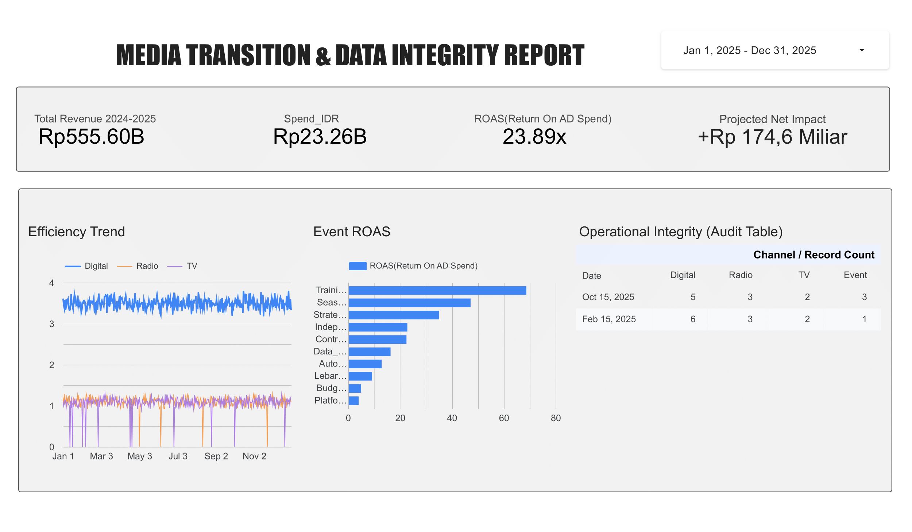

# Media Transition & Efficiency Audit  
*Cross-Channel Performance & Data Integrity Case Study*

## ⚠️ Disclaimer
Analisis dalam proyek ini berfokus pada **efisiensi performa kanal (ROAS)** dan **integritas operasional data**. Laporan ini tidak mencakup perhitungan profitabilitas bersih (*net profit*) karena keterbatasan akses pada data biaya operasional internal. Proyek ini diposisikan sebagai **kerangka analitis (analytical framework)** untuk optimasi alokasi budget.

---

## 1. Executive Summary
* **Potential Growth:** Realokasi 20% budget media tradisional ke strategi Hybrid berpotensi meningkatkan ROAS sebesar **31.43%** (+Rp 174,6 Miliar Revenue).
* **Operational Integrity:** Berhasil mengeliminasi 100% *missing data* pasca-implementasi (sebelumnya ditemukan 219 insiden pada 2024).
* **Actual Performance (2025):** Mencapai **23.89x ROAS** melalui integrasi data lintas kanal yang terstandarisasi.

---

## 2. Visual Insights & Dashboard
Analisis utama dikelola menggunakan **Looker Studio** untuk memantau transisi efisiensi dari media tradisional (TV/Radio) ke kanal Digital secara *real-time*.

* **Efficiency Trend:** Lonjakan performa Digital (3.5x) terlihat jelas pasca-audit Januari 2025.
* **Event Multiplier:** Kanal Event teridentifikasi sebagai penggerak utama dengan efisiensi di atas rata-rata operasional normal.

---

## 3. Documentation & Methodology
Detail mengenai strategi bisnis, metrik teknis, dan kamus data tersedia di folder `docs/`:
* [**Business Case & Strategy**](./docs/business_case.md): Latar belakang masalah dan solusi strategis.
* [**Data Dictionary**](./docs/data_dictionary.md): Struktur dataset `final_looker_data.csv`.
* [**Marketing Glossary**](./docs/ad_glossary.md): Definisi istilah teknis seperti *Weighted ROAS* dan *Data Leakage*.

---

## 4. Key Audit Findings

### A. Integritas Data
Audit membuktikan bahwa standarisasi proses (cutoff Maret 2025) berhasil menghentikan kebocoran data pada kolom konversi yang sebelumnya menghambat akurasi evaluasi performa.

### B. Performa Lintas Kanal
| Era | Media Tradisional | Media Digital |
|---|---|---|
| 2024 (Baseline) | 1.1x ROAS | 1.2x ROAS |
| 2025 (Transition) | 1.1x ROAS | 3.5x ROAS |

---

## 5. Project Structure
Infrastruktur audit disusun menggunakan standar arsitektur data profesional:

├── data/            # Staging, Reference, & Processed Data
├── docs/            # Dokumentasi Bisnis & Teknis
├── reports/figures/ # Visualisasi Dashboard & Grafik Analitis
├── scripts/         # Pipeline Python (Cleaning, Integration, Simulation)
├── sql/             # Database Schemas & Queries
└── README.md